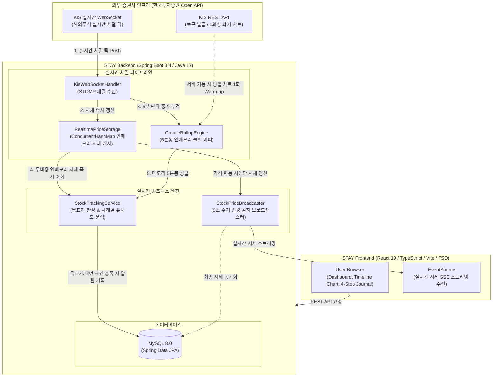

<div align="center">
  <!-- 배너 이미지: 추후 교체 -->
  
</div>

<br />

<div align="center">

# STAY

**변동성에 흔들리지 않는, 나만의 반도체 투자 원칙** 🎯

[](https://openjdk.org/)
[](https://spring.io/projects/spring-boot)
[](https://react.dev/)
[](https://www.typescriptlang.org/)
[](https://www.mysql.com/)

</div>

<br />

<!-- 섹션 1: 문제 제기 -->
<h2>
  🚨 Problem: 변동성 장세 앞에서의 뇌동매매
</h2>

> _**"엔비디아가 급등할 때 따라 샀다가, 급락할 때 공포에 던지는 실수를 왜 반복할까요?"**_

**1. 높은 변동성과 감정적 매매(뇌동매매)의 악순환**

해외 반도체 주식은 AI 사이클과 글로벌 이슈에 따라 일일 변동 폭이 매우 큽니다. 대다수의 개인 투자자는 명확한 매매 기준 없이 진입했다가, 급격한 시세 변동 앞에서 공포나 탐욕에 휘둘려 비이성적인 손절이나 추격 매수를 반복하게 됩니다.

<br />

**2. 기록 없는 투자는 반성을 남기지 않는다**

<div align="center">
  <!-- 문제 상황 시각화 이미지: 추후 교체 -->
  
</div>

- **매매 당시의 감정과 이유 망각**: 왜 이 가격에 샀는지, 목표가와 손절가는 얼마였는지 기록하지 않아 같은 패턴의 실패를 되풀이합니다.
- **실시간 감시 부재로 인한 원칙 훼손**: 장중에 차트를 계속 들여다볼 수 없어 사전에 정해둔 매도 타이밍을 놓치고 감정적인 결정을 내리게 됩니다.

<br />

<!-- 섹션 2: 해결책 및 3대 핵심 가치 -->
<h2>
  💡 Solution: STAY가 제시하는 투자 원칙 솔루션
</h2>

<div align="center">
  <strong>STAY는 4단계 매매일지 기록과 무비용 실시간 인메모리 감시 파이프라인을 결합하여 감정에 휘둘리지 않는 투자를 돕습니다.</strong>
  
  <br />
  <br />
  <!-- 서비스 핵심 로고/다이어그램: 추후 교체 -->
  
  <br />
  <br />
</div>

> **Principle (원칙 중심 매매)**

- 거래 체결가뿐만 아니라 **'매수 이유', '거래 당시 감정', '목표가/손절가'**를 4단계로 체계적으로 기록합니다.
- 일시적 감정 상태를 인지하게 하여 충동적인 매매를 사전에 차단합니다.

<br />

> **Realtime Tracking (실시간 시세 & 패턴 감시)**

- 한국투자증권 실시간 웹소켓 체결 틱을 활용하여, **외부 API 호출 낭비(0건) 없이 서버 내부 인메모리 파이프라인으로 목표가 및 손절가를 24시간 감시**합니다.
- 과거 성공/실패했던 매매 당시의 차트 흐름과 현재 장중 5분봉 시계열을 비교하여 유사 흐름 발생 시 실시간으로 알림을 전달합니다.

<br />

> **Insight (시각적 차트 타임라인 회고)**

- 과거 내가 기록한 매매일지와 감정 상태를 차트 캔들 위의 인터랙티브 타임라인 뱃지로 시각화합니다.
- 언제 감정적 실수를 했는지 한눈에 복기하며 자신만의 객관적인 매매 기준을 찾아갑니다.

<br />

<!-- 섹션 3: 주요 기능 -->
<h2>
  ✨ Key Features
</h2>

<h3>
  1. 4단계 매매일지 작성 및 원칙 설정
</h3>

체결가와 수량 기록부터 목표가/손절가 설정, 매매 당시의 심리와 거래 이유, 그리고 차트 시계열 스냅샷까지 4단계에 걸쳐 체계적으로 일지를 작성합니다.

<br />

<div align="center">
  
</div>

<br />
<br />

<h3>
  2. 타임라인 인터랙티브 차트 및 매매 복기
</h3>

1일(5분봉)부터 5년(월봉)까지 다양한 기간의 캔들 차트 위에 나의 과거 매매 시점과 당시의 감정 뱃지가 표시되어 직관적인 복기가 가능합니다.

<br />

<div align="center">
  
</div>

<br />
<br />

<h3>
  3. 실시간 시세 스트리밍 (SSE)
</h3>

외부 증권사 API를 불필요하게 호출하지 않고, 백엔드 웹소켓 인메모리 캐시를 기반으로 변동이 발생한 종목의 시세만을 5초 주기로 브라우저에 끊김 없이 스트리밍합니다.

<br />

<div align="center">
  <br />
  <figcaption align="center">▲ 해외 반도체 8대 핵심 종목 실시간 대시보드</figcaption>
</div>

<br />
<br />

<h3>
  4. 무비용(0 API Call) 실시간 목표가 및 주가 흐름 패턴 감시
</h3>

- **목표가 감시**: 서버 인메모리 캐시(`ConcurrentHashMap`)를 활용하여 $O(1)$ 무비용으로 목표가/손절가 도달 여부를 실시간 판정합니다.
- **5분봉 롤업 & 패턴 매칭**: 증권사 차트 API를 매번 호출하지 않고 웹소켓 체결 틱을 5분 단위로 메모리에서 직접 묶어(Rollup), 과거 매매 패턴과의 시계열 유사도를 실시간 분석합니다.

<br />

<div align="center">
  <br />
  <figcaption align="center">▲ 목표가 도달 및 차트 패턴 일치 알림 수신 화면</figcaption>
</div>

<br />

<!-- 섹션 5: 아키텍처 및 시스템 구조도 -->
<h2>
  🏛️ Architecture & System Design
</h2>

### System Architecture Diagram



<br />

### 📁 Project Structure

```yaml
STAY/
├── backend/
│   └── src/
│       ├── main/
│       │   ├── java/com/stay/backend/
│       │   │   ├── domain/
│       │   │   │   ├── journal/       # 4단계 매매일지 (기록, 감정, STAY 원칙)
│       │   │   │   ├── stock/         # 종목, 차트 시세 및 실시간 감시 도메인
│       │   │   │   │   ├── controller/
│       │   │   │   │   ├── service/   # StockTrackingService (목표가 & 패턴 추적)
│       │   │   │   │   └── storage/   # RealtimePriceStorage, CandleRollupEngine
│       │   │   │   └── user/          # 사용자 인증 및 프로필
│       │   │   ├── global/            # 공통 응답, 예외 처리, 보안, 캐시 설정
│       │   │   └── infra/
│       │   │       ├── kis/           # KIS 웹소켓 핸들러 및 REST API 클라이언트
│       │   │       └── sse/           # 실시간 시세 SSE 브로드캐스터
│       │   └── resources/             # application.yml, 초기 종목 seed 데이터
│       └── test/                      # 동시성 및 감시 파이프라인 단위/통합 테스트
├── frontend/
│   └── src/
│       ├── app/                       # 전역 설정, 프로바이더, 라우팅
│       ├── pages/                     # 대시보드, 매매일지, 차트 뷰 페이지
│       ├── widgets/                   # 추천 원칙 피드, 인사이트 캐러셀 등 독립 UI 블록
│       ├── features/                  # 타임라인 마커, 주가 차트 뷰어 등 기능 컴포넌트
│       ├── entities/                  # Stock, Journal 핵심 비즈니스 모델 및 쿼리 훅
│       └── shared/                    # UI 컴포넌트 라이브러리, API 클라이언트, 유틸
└── README.md
```

<br />

### 🛠️ Technology Stack

| Category | Technology |
| :--- | :--- |
| **Backend** |       |
| **Frontend** |       |
| **Realtime & Protocol** |   |
| **Testing** |   |

<br />

<!-- 섹션 6: 프로젝트 링크 및 푸터 -->
<h2>
  👥 Team & Links
</h2>

<div align="center">

**STAY 프로젝트를 확인해주셔서 감사합니다.**  
변동성에 흔들리지 않고 원칙을 지키는 건강한 반도체 투자 문화를 만들어갑니다.

<br />

[](https://github.com/JJJ-un)

<br />

Copyright © 2026 **STAY**. All rights reserved.

</div>
