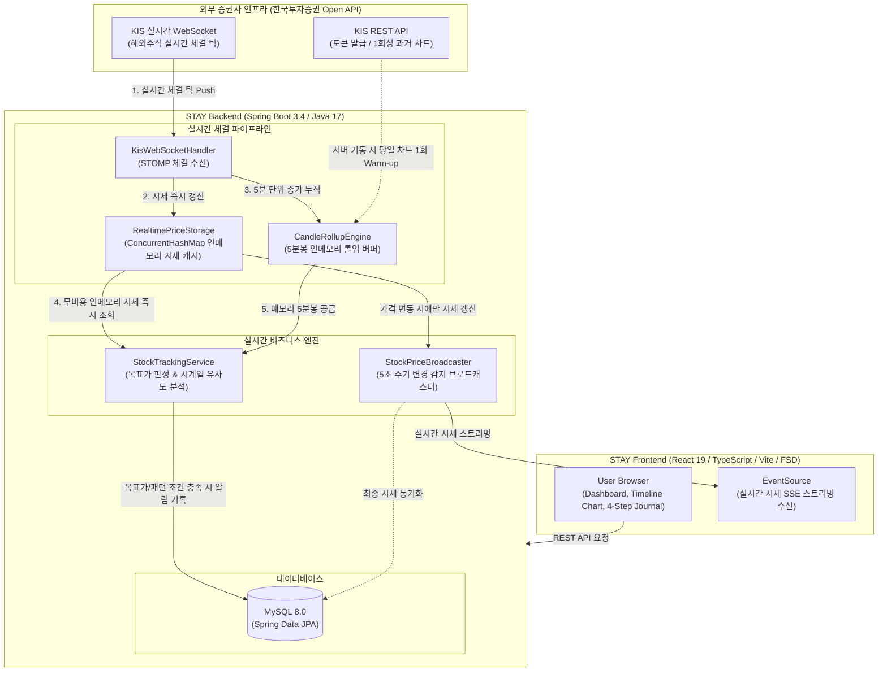

<div align="center">
  <!-- 배너 이미지: 추후 교체 -->
  
</div>

<br />

<div align="center">

# STAY

**변동성에 흔들리지 않는, 나만의 반도체 투자 원칙** 🎯

[](https://openjdk.org/)
[](https://spring.io/projects/spring-boot)
[](https://react.dev/)
[](https://www.typescriptlang.org/)
[](https://www.mysql.com/)

</div>

<br />

<!-- 섹션 1: 문제 제기 -->
<h2>
  🚨 Problem: 변동성 장세 앞에서의 뇌동매매
</h2>

> _**"엔비디아가 급등할 때 따라 샀다가, 급락할 때 공포에 던지는 실수를 왜 반복할까요?"**_

**1. 높은 변동성과 감정적 매매(뇌동매매)의 악순환**

해외 반도체 주식은 AI 사이클과 글로벌 이슈에 따라 일일 변동 폭이 매우 큽니다. 대다수의 개인 투자자는 명확한 매매 기준 없이 진입했다가, 급격한 시세 변동 앞에서 공포나 탐욕에 휘둘려 비이성적인 손절이나 추격 매수를 반복하게 됩니다.

<br />

**2. 기록 없는 투자는 반성을 남기지 않는다**

<div align="center">
  <!-- 문제 상황 시각화 이미지: 추후 교체 -->
  
</div>

- **매매 당시의 감정과 이유 망각**: 왜 이 가격에 샀는지, 목표가와 손절가는 얼마였는지 기록하지 않아 같은 패턴의 실패를 되풀이합니다.
- **실시간 감시 부재로 인한 원칙 훼손**: 장중에 차트를 계속 들여다볼 수 없어 사전에 정해둔 매도 타이밍을 놓치고 감정적인 결정을 내리게 됩니다.

<br />

<!-- 섹션 2: 해결책 및 3대 핵심 가치 -->
<h2>
  💡 Solution: STAY가 제시하는 투자 원칙 솔루션
</h2>

<div align="center">
  <strong>STAY는 4단계 매매일지 기록과 무비용 실시간 인메모리 감시 파이프라인을 결합하여 감정에 휘둘리지 않는 투자를 돕습니다.</strong>
  
  <br />
  <br />
  <!-- 서비스 핵심 로고/다이어그램: 추후 교체 -->
  
  <br />
  <br />
</div>

> **Principle (원칙 중심 매매)**

- 거래 체결가뿐만 아니라 **'매수 이유', '거래 당시 감정', '목표가/손절가'**를 4단계로 체계적으로 기록합니다.
- 일시적 감정 상태를 인지하게 하여 충동적인 매매를 사전에 차단합니다.

<br />

> **Realtime Tracking (실시간 시세 & 패턴 감시)**

- 한국투자증권 실시간 웹소켓 체결 틱을 활용하여, **외부 API 호출 낭비(0건) 없이 서버 내부 인메모리 파이프라인으로 목표가 및 손절가를 24시간 감시**합니다.
- 과거 성공/실패했던 매매 당시의 차트 흐름과 현재 장중 5분봉 시계열을 비교하여 유사 흐름 발생 시 실시간으로 알림을 전달합니다.

<br />

> **Insight (시각적 차트 타임라인 회고)**

- 과거 내가 기록한 매매일지와 감정 상태를 차트 캔들 위의 인터랙티브 타임라인 뱃지로 시각화합니다.
- 언제 감정적 실수를 했는지 한눈에 복기하며 자신만의 객관적인 매매 기준을 찾아갑니다.

<br />

<!-- 섹션 3: 주요 기능 -->
<h2>
  ✨ Key Features
</h2>

<h3>
  1. 4단계 매매일지 기록 및 감정·원칙 데이터 모델링
</h3>

단순 체결가와 수량 기록을 넘어, 거래 사실(1단계) ➔ 매매 원칙(2단계: 목표가/손절가/보유기간) ➔ 심리 상태(3단계: 감정/이유/STAY 다짐) ➔ 차트 시계열 스냅샷(4단계)을 하나의 완결된 도메인 모델로 통합 관리합니다. 기록된 차트 스냅샷은 향후 실시간 패턴 감시 엔진의 비교군 기준 데이터로 활용됩니다.

<br />

<div align="center">
  <br />
  <figcaption align="center">▲ 4단계 매매일지 작성 및 심리·원칙 기록 화면</figcaption>
</div>

<br />
<br />

<h3>
  2. 인메모리 파이프라인 기반 실시간 시세·패턴 감시 및 알림
</h3>

증권사 Open API의 초당 호출 제한(Rate Limit)을 극복하기 위해, 웹소켓 실시간 체결 틱을 활용한 인메모리 파이프라인을 구축했습니다.

- **목표가·손절가 감시**: 웹소켓 체결가를 인메모리 저장소(`ConcurrentHashMap`)에 즉시 갱신하고, 스케줄러가 외부 API 호출 없이 $O(1)$로 시세를 조회하여 목표가 도달 여부를 실시간 판정합니다.
- **5분봉 인메모리 롤업 & 패턴 매칭**: 5분마다 외부 차트 API를 호출하는 대신 웹소켓 체결가로 메모리에서 직접 5분봉 종가를 누적하고, 사용자가 기록한 과거 차트 패턴과의 시계열 유사도(DTW)를 연산하여 조건 충족 시 실시간 알림을 발송합니다.
- **연속성 보장 (Warm-up)**: 서버 재부팅 시 메모리 데이터 휘발 문제를 방지하기 위해, 기동 시점에 차트 API를 1회만 호출해 당일 이전 캔들을 채워두는 사전 적재를 적용했습니다.

<br />

<div align="center">
  <br />
  <figcaption align="center">▲ 무비용 인메모리 실시간 목표가 판정 및 패턴 매칭 알림</figcaption>
</div>

<br />
<br />

<h3>
  3. SSE 실시간 시세 스트리밍 및 타임라인 차트 시각화
</h3>

- **변경 감지 기반 SSE 스트리밍**: 5초 주기 브로드캐스팅 시 직전 가격과의 변동 여부를 검증하는 가드(`isStockPriceChanged`)를 두어, 실제 가격 변동이 발생한 종목에 대해서만 클라이언트 단방향 스트리밍(SSE) 및 DB 동기화를 수행함으로써 불필요한 네트워크 및 I/O 낭비를 방지합니다.
- **인터랙티브 타임라인 차트 복기**: 1일(5분봉)부터 5년(월봉)까지의 캔들 차트 위에 사용자의 과거 매매 체결 시점과 당시의 감정(Emotion)을 타임라인 마커(Badge) 형태로 시각화하여, 주가 흐름과 자신의 심리 변화를 직관적으로 복기할 수 있도록 지원합니다.

<br />

<div align="center">
  <br />
  <figcaption align="center">▲ 캔들 차트 위 매매 시점 감정 마커 및 실시간 시세 스트리밍</figcaption>
</div>

<br />

<!-- 섹션 5: 아키텍처 및 시스템 구조도 -->
<h2>
  🏛️ Architecture & System Design
</h2>

### System Architecture Diagram



<br />

### 📁 Project Structure

```yaml
STAY/
├── backend/
│   └── src/
│       ├── main/
│       │   ├── java/com/stay/backend/
│       │   │   ├── domain/
│       │   │   │   ├── journal/       # 4단계 매매일지 (기록, 감정, STAY 원칙)
│       │   │   │   ├── stock/         # 종목, 차트 시세 및 실시간 감시 도메인
│       │   │   │   │   ├── controller/
│       │   │   │   │   ├── service/   # StockTrackingService (목표가 & 패턴 추적)
│       │   │   │   │   └── storage/   # RealtimePriceStorage, CandleRollupEngine
│       │   │   │   └── user/          # 사용자 인증 및 프로필
│       │   │   ├── global/            # 공통 응답, 예외 처리, 보안, 캐시 설정
│       │   │   └── infra/
│       │   │       ├── kis/           # KIS 웹소켓 핸들러 및 REST API 클라이언트
│       │   │       └── sse/           # 실시간 시세 SSE 브로드캐스터
│       │   └── resources/             # application.yml, 초기 종목 seed 데이터
│       └── test/                      # 동시성 및 감시 파이프라인 단위/통합 테스트
├── frontend/
│   └── src/
│       ├── app/                       # 전역 설정, 프로바이더, 라우팅
│       ├── pages/                     # 대시보드, 매매일지, 차트 뷰 페이지
│       ├── widgets/                   # 추천 원칙 피드, 인사이트 캐러셀 등 독립 UI 블록
│       ├── features/                  # 타임라인 마커, 주가 차트 뷰어 등 기능 컴포넌트
│       ├── entities/                  # Stock, Journal 핵심 비즈니스 모델 및 쿼리 훅
│       └── shared/                    # UI 컴포넌트 라이브러리, API 클라이언트, 유틸
└── README.md
```

<br />

### 🛠️ Technology Stack

| Category | Technology |
| :--- | :--- |
| **Backend** |       |
| **Frontend** |       |
| **Realtime & Protocol** |   |
| **Testing** |   |

<br />

<!-- 섹션 6: 프로젝트 링크 및 푸터 -->
<h2>
  👥 Team & Links
</h2>

<div align="center">

**STAY 프로젝트를 확인해주셔서 감사합니다.**  
변동성에 흔들리지 않고 원칙을 지키는 건강한 반도체 투자 문화를 만들어갑니다.

<br />

[](https://github.com/JJJ-un)

<br />

Copyright © 2026 **STAY**. All rights reserved.

</div>
